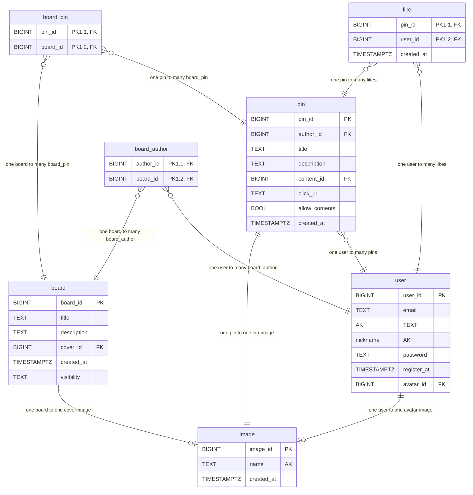

```mermaid
erDiagram
    user {
        BIGINT user_id PK
        TEXT email AK
        TEXT nickname AK
        TEXT password
        TIMESTAMPTZ register_at
        BIGINT avatar_id FK
    }
    pin {
        BIGINT pin_id PK
        BIGINT author_id FK
        TEXT title
        TEXT description
        BIGINT content_id FK
        TEXT click_url
        BOOL allow_coments
        TIMESTAMPTZ created_at
    }
    board {
        BIGINT board_id PK
        TEXT title
        TEXT description
        BIGINT cover_id FK
        TIMESTAMPTZ created_at
        TEXT visibility
    }
    like {
        BIGINT pin_id "PK1.1, FK"
        BIGINT user_id "PK1.2, FK"
        TIMESTAMPTZ created_at
    }
    board_author {
        BIGINT author_id "PK1.1, FK"
        BIGINT board_id "PK1.2, FK"
    }
    board_pin {
        BIGINT pin_id "PK1.1, FK"
        BIGINT board_id "PK1.2, FK"
    }
    image {
        BIGINT image_id "PK"
        TEXT name "AK"
        TIMESTAMPTZ created_at 
    }

    pin o{--|| user : "one user to many pins"
    board_pin o{--|| pin : "one pin to many board_pin"
    board_pin o{--|| board : "one board to many board_pin"
    board_author o{--|| user : "one user to many board_author"
    board_author o{--|| board : "one board to many board_author"
    like o{--|| user : "one user to many likes"
    like o{--|| pin : "one pin to many likes"
    user ||--o| image : "one user to one avatar-image"
    pin ||--|| image : "one pin to one pin-image"
    board ||--o| image : "one board to one cover-image"
```
