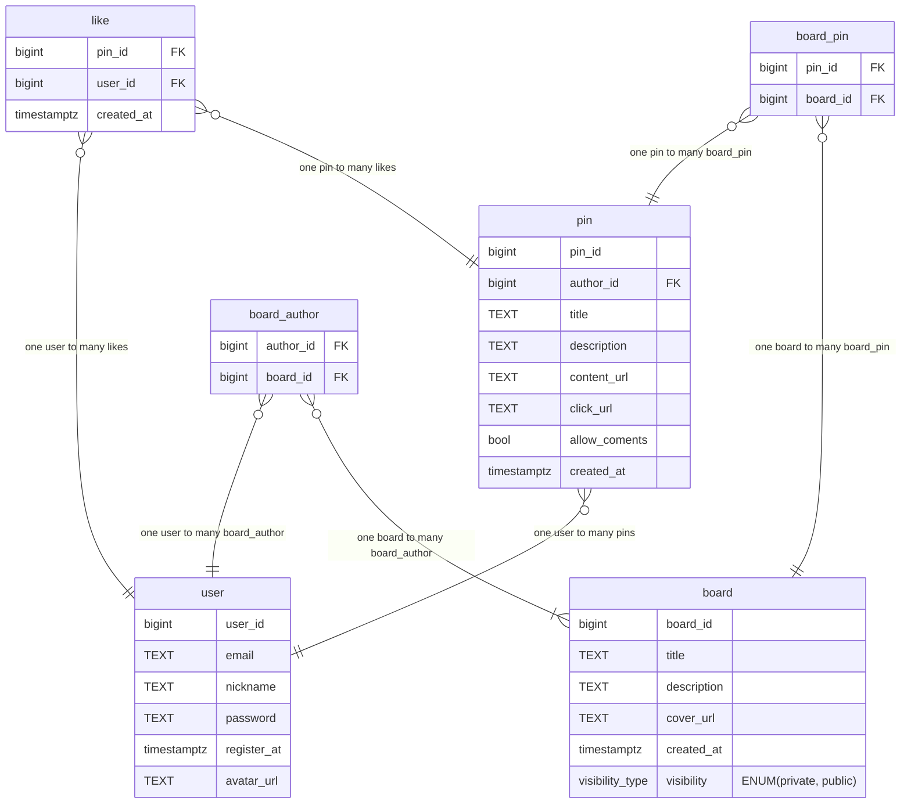

```mermaid
erDiagram
    user {
        bigint user_id
        TEXT email
        TEXT nickname
        TEXT password
        timestamptz register_at
        TEXT avatar_url
    }
    pin {
        bigint pin_id 
        bigint author_id FK
        TEXT title
        TEXT description
        TEXT content_url
        TEXT click_url
        bool allow_coments
        timestamptz created_at
    }
    board {
        bigint board_id
        TEXT title
        TEXT description
        TEXT cover_url
        timestamptz created_at
        visibility_type visibility "ENUM(private, public)"
    }
    like {
        bigint pin_id FK
        bigint user_id FK
        timestamptz created_at
    }
    board_author {
        bigint author_id FK
        bigint board_id FK
    }
    board_pin {
        bigint pin_id FK
        bigint board_id FK
    }
    pin o{--|| user : "one user to many pins"
    board_pin o{--|| pin : "one pin to many board_pin"
    board_pin o{--|| board : "one board to many board_pin"
    board_author o{--|| user : "one user to many board_author"
    board_author o{--|{ board : "one board to many board_author"
    like o{--|| user : "one user to many likes"
    like o{--|| pin : "one pin to many likes"
```
