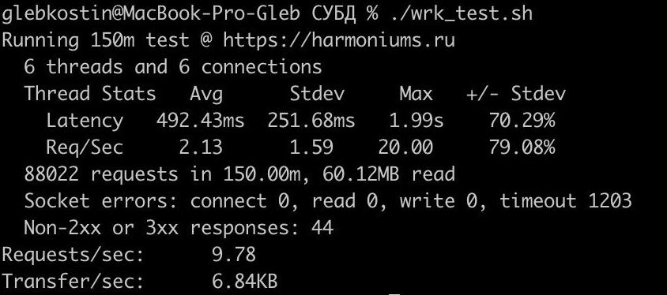
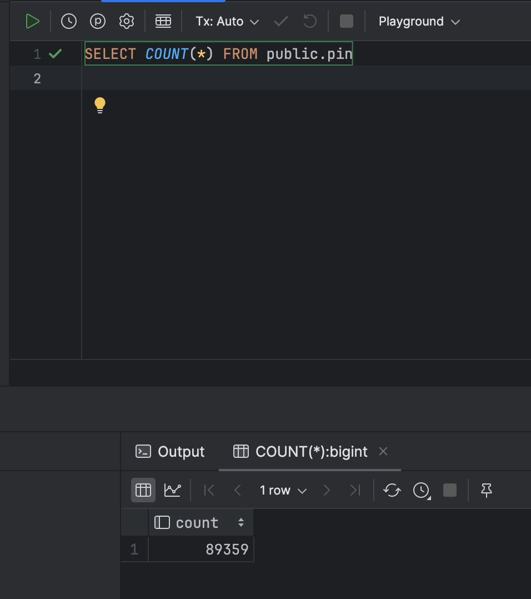
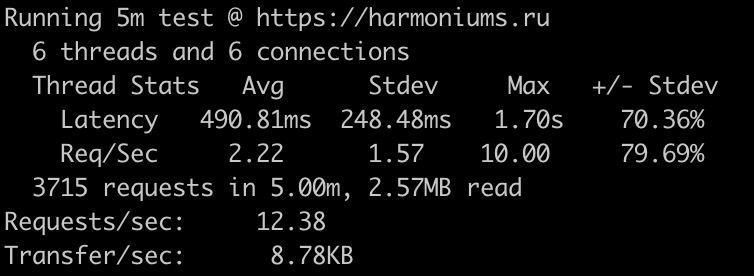

# ДЗ3

## Сущность
В качестве "основной сущности" нашего приложения мы выбрали пины. В рамках тестирования мы загружаем картинку и заполняем данными поля заголовка и описания пина.

## Подготовка 
Для проведения нагрузочного тестирования был выбран инструмент [wrk](https://github.com/wg/wrk).
Установка wrk на macOS происходит с помощью следующей команды: 
```
brew install wrk
```

### Тестирование POST API Endpoint'а
Запускается с помощью bash-скрипта [post_wrk_test.sh](https://github.com/go-park-mail-ru/2024_1_Harmonica/blob/har-148-add-dbms2/internal/repository/perf_test/post_wrk_test.sh), который выполняет следующие действия:
 - получает csrf-токен
 - подставляет csrf-токен в запрос на авторизацию, производит ее и  получает session-токен
 - запускает тестирование

Подробнее разберем команду запуска:
```
wrk -t6 -c6 -d150m https://harmoniums.ru \
    -H "X-CSRF-Token: ${csrf_token}" \
    -H "Cookie: _gorilla_csrf=${gorilla_csrf}; session_token=${session_token}" \
    -s ./post_wrk_test.lua
```
Параметры тестирования: 6 потоков, 6 HTTP-соединений, длительность - 150 минут. 
Данные запроса формируются Lua-скриптом [post_wrk_test.lua](https://github.com/go-park-mail-ru/2024_1_Harmonica/blob/har-148-add-dbms2/internal/repository/perf_test/post_wrk_test.lua), который включает в тело запроса изображение и данные о пине.

### Тестирование GET API Endpoint'а
Запускается с помощью bash-скрипта [get_wrk_test.sh](https://github.com/go-park-mail-ru/2024_1_Harmonica/blob/har-148-add-dbms2/internal/repository/perf_test/get_wrk_test.sh). В данном случае авторизация уже не нужна, нужен только csrf-токен.

Команда запуска (содержится внутри [post_wrk_test.sh](https://github.com/go-park-mail-ru/2024_1_Harmonica/blob/har-148-add-dbms2/internal/repository/perf_test/post_wrk_test.sh)):
```
wrk -t6 -c6 ?
```
Данные запроса формируются Lua-скриптом [get_wrk_test.lua](https://github.com/go-park-mail-ru/2024_1_Harmonica/blob/har-148-add-dbms2/internal/repository/perf_test/get_wrk_test.lua).

## Создание сущности
Перейдем в директорию [perf_test](https://github.com/go-park-mail-ru/2024_1_Harmonica/tree/har-148-add-dbms2/internal/repository/perf_test), где хранится все необходимое для запуска тестирования.
Сделаем файл [post_wrk_test.sh](https://github.com/go-park-mail-ru/2024_1_Harmonica/blob/har-148-add-dbms2/internal/repository/perf_test/post_wrk_test.sh) исполняемым с помощью команды:
```
chmod +x ./post_wrk_test.sh
```
И затем запустим его:
```
chmod +x ./post_wrk_test.sh
```
Полученный отчет:


По отчету видим, что было отправлено 88,022 запросов.

Количество пинов в базе после окончания выполнения скрипта - 89,359 (до начала проведения тестирования в базе уже были пины):


В ходе тестирования произошла следующая ситуация - на время упал деплой.
(Из-за этого на практике RPS оказался меньше, чем рассчитывалось, и, соотвественно, создалось меньше пинов.)

## Чтение сущности
Повторим действия, описанные выше, с файлами [get_wrk_test.sh](https://github.com/go-park-mail-ru/2024_1_Harmonica/blob/har-148-add-dbms2/internal/repository/perf_test/get_wrk_test.sh) и [get_wrk_test.lua](https://github.com/go-park-mail-ru/2024_1_Harmonica/blob/har-148-add-dbms2/internal/repository/perf_test/get_wrk_test.lua) соответственно.

Полученный отчет:


## Улучшения 

Для улучшения результатов можно:
 - оптимизировать данные в столбцах; к примеру, не хранить ссылку на фото целиком, а хранить только ту часть, которая изменяется.
 - ускорить сортировку и поиск данных, добавив индекс по столбцам `created_at` и `author_id`.
